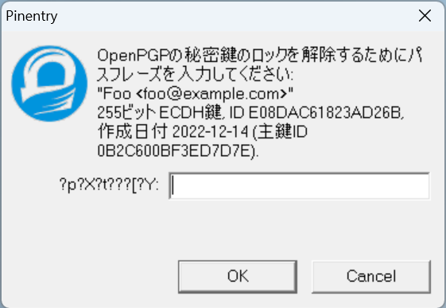
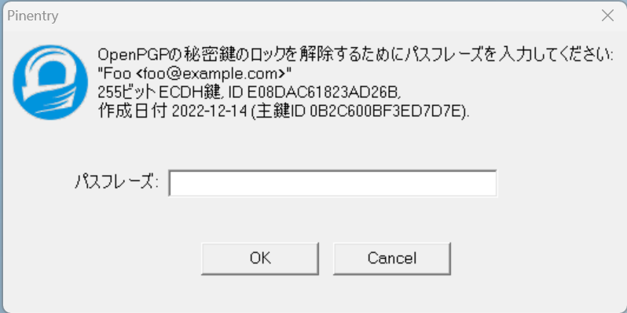
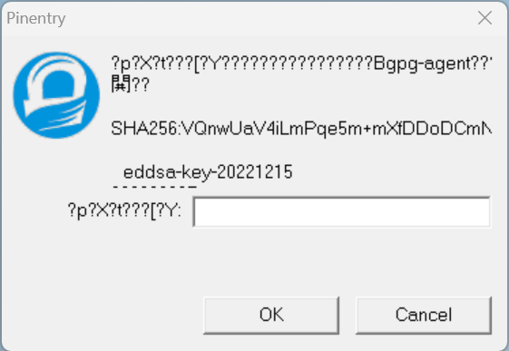

# pinentry-w32, no characters garbled

This repository sets up GitHub Action for pinentry-w32 build workflow
with small hack to solve garbled characters in non UTF-8 codepage environment.

## Screenshots

| pinentry-w32                              | pinentry-w32-ncg                                  |
|-------------------------------------------|---------------------------------------------------|
|  |  |
|  |  |

## Setup

### Install

Grab a package (`pinentry-w32-ncg-v<version>.zip`) from [GitHub releases](https://github.com/iquiw/pinentry-w32-ncg-binary/releases)
and extract it to some place (denoted by `<EXTRACT_DIR>` below).

### Configuration

Edit gpg-agent.conf, typically `~/AppData/Roaming/gnupg/gpg-agent.conf`, to add;

```conf
pinentry-program <EXTRACT_DIR>/pinentry-w32.exe
```

## Patches

### Garbled characters fix

`0001-Fix-character-garbled-in-non-UTF-8-Windows-environme.patch`

* Tries to convert input texts by ANSI codepage (`CP_ACP`) first, and then by UTF-8 (`CP_UTF8`).

### Dialog size refinement

`0002-Adjust-dialog-and-its-components-size.patch`

* Increases dialog width and its components widths so that the whole SSH fingerprint is visible.
* Keep the dialog foreground.
